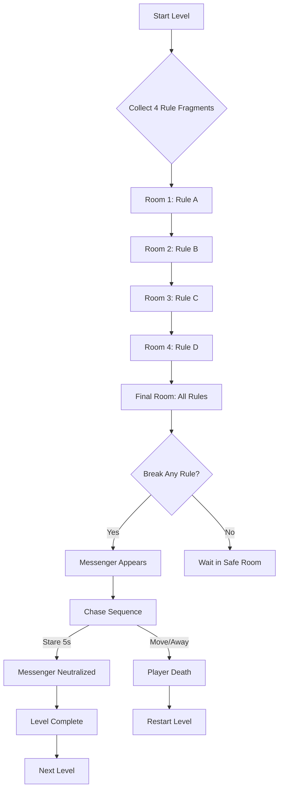
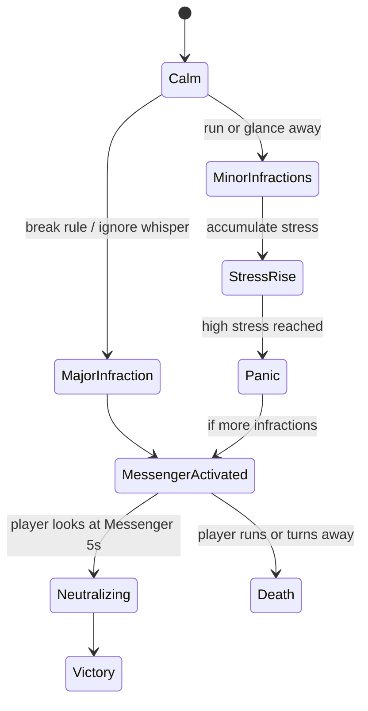

# Level 4 **“Rules of KONTUR”** – Analytical Report

**Executive Summary:** This report analyzes the current design documentation of Level 4 (“Rules of KONTUR”) and identifies gaps in atmosphere, narrative, and panic mechanics. We propose concrete enhancements: dynamic **visuals** (e.g. flickering lights, environment details), richer **audio** (directional whispers, heartbeat sound effects), deeper **narrative context** (integrate CONTUR lore via signs or logs), and new **gameplay triggers** (additional scare events, paced puzzle mechanics). We outline a balanced **panic mechanic** (panic meter with feedback), implementation guidelines (using Unity lighting scripts, spatial audio, UI canvas for rules), and testing strategies (A/B variants, telemetry of panic level and completion time). A comparison table highlights current elements vs. improvements. We include mermaid flow diagrams for event sequences and panic-trigger states, propose **metrics** (e.g. time-to-complete, number of panic triggers activated), and a checklist for designers/programmers. Finally, we list challenge questions to guide further level refinement.

| **Category** | **Current State** | **Proposed Enhancement** |
|---|---|---|
| **Lighting & Atmosphere** | Static dim lighting with occasional VHS overlay; no real-time change. | **Dynamic Lighting:** Introduce flickering or pulsing lights tied to panic level (e.g. use Unity’s light flicker scripts or color shifts from cold blue to warm red). Research shows static lighting dampens tension; dynamic light patterns (e.g. sudden dimming or color change) can increase suspense. Implement environmental hazards (broken ceiling lights, slowly moving shadows). |
| **Visual Details** | Bare corridors and rooms, minimal set-dressing. | **Environmental Props:** Add peeling posters with the KONTUR logo, lab equipment, bloodstains, and torn documents. Include “found footage” elements (old VHS cameras, flickering monitor screens). For example, generating an *abandoned research hallway* scene (see Figure below) with prompt: *“dark abandoned scientific corridor with flickering fluorescent lights and peeling paint; gritty horror atmosphere”*. |
| **Monster Design** | Messenger appears as a smoke silhouette with white face-spot. | **Creature Effects:** Emphasize the Messenger’s silhouette with particle effects (e.g. swirling spores or static). Add **visual distortion** (screen glitches, camera static) when it spawns. A generated image prompt: *“ghostly smoky humanoid silhouette with a glowing white face patch in a dark room”* (illustrative example in Figure). |
| **Audio** | Whisper triggers (“Don’t look back” tape); ambient whispering in final area. | **Layered Soundscape:** Use **3D directional whispers** guiding or taunting the player (e.g. voice inside ear). Play an ominous **heartbeat/breathing** SFX that accelerates as stress rises. Add environmental sounds: distant dripping water, radio static, machine hums. Ambient music can change mode (minor key) when panic meter fills. Safe-room “relief” music should play subtly after victory.  |
| **Narrative/Lore** | Rule fragments collected as puzzle items; no context given. | **Contextual Storytelling:** Embed CONTUR universe lore in the level. Place **radios, terminals or notes** describing O-41 (spore) experiments or the Teller’s history. For example, on a wall or VHS tape, include a list of “Kontur rules” reminiscent of the sanatorium video rules. This ties the level to known stories and gives meaning to the puzzle. Use UI Canvas or in-game screens to display fragments in CONTUR’s stylized text (e.g. glitchy green terminal text). |
| **Puzzle Design** | Collect 4 rule fragments (rooms 1–4), then apply them in final room to defeat Messenger. | **Puzzle Clues:** Make each room’s theme hint the rule (e.g. a spotlight and mirror in Room 1 to hint “Don’t stare”; treadmill in Room 2 for “Don’t run”). Use **environmental cues** (highlight corridors leading to fragments). Allow subtle hints (e.g. interactive objects that whisper a rule when gazed at). Ensure fragments are found by **exploration and attention**, not random. |
| **Monster Triggers** | Violating any rule immediately spawns Messenger.  | **Balanced Triggers:** Instead of instant spawn on any violation, consider **threshold triggers**. For instance, count minor infractions (running briefly, looking away) and spawn only after repeated or major rule-breaks. This prevents constant respawns. Add **jumpscare events** (e.g. flicker of silhouette in periphery) to build dread before full spawn. Provide fleeting glimpses in dark zones to maintain tension without instant death. |
| **Panic Mechanic** | Stress meter increases slowly in periphery and doubles in dark; Messenger has a gaze-based neutralization. | **Panic Meter UI:** Add an on-screen **panic gauge** (like Amnesia’s sanity or Clock Tower’s meter) that fills with stress. Provide feedback: edge-of-screen blur, vignette, or color shift as panic rises. **Balance:** Calibrate stress growth so that minor scares tick up the meter, but full panic should only occur after sustained fear. Align with lore: only “compliant” players (i.e. who don’t break protocol) remain calm. |
| **Balancing** | No metrics defined for pass/fail rates, pacing, or playtests. | **Testing Metrics:** Track key metrics via telemetry: time to find fragments, number of rule-violations, panic meter peaks, death triggers. Use A/B tests: e.g. version A with subtle whisper cues vs. version B with louder cues, and compare average completion time and player reported fear. Define **panic threshold** for auto-fail and adjust via playtest data. After-play surveys or biometric data (if available) can validate intended stress levels. |

## Visual and Audio Design Enhancements

 *Figure: Example of an **abandoned corridor**. Prompt for image generation: “Dark abandoned research hallway with flickering fluorescent lights, cracked tile floor and peeling green paint, moody horror atmosphere.”*  
Building on established horror lighting research, avoid fully black rooms (which reduce skill-based tension). Instead, mix low light and dark corners. For example, use **dynamic lights** that briefly flicker or sway when the player is near certain triggers. Add **color filtering**: a blue-green hue can signal sickness, switching to warm red during panic spikes. Include **practical lights** (wall lamps, computer monitors) as the only illumination in some areas.  

 *Figure: Faded laboratory hallway (unsplash example, prompt: “Dim abandoned laboratory corridor with old equipment and broken door, eerie glow”).*  
Scatter environmental props to enrich atmosphere: old lab equipment (microscopes, glass vials), cryptic schematics on walls, torn scribbled notes mentioning “О-41” or “spore growth.” A subtle VHS overlay (static, tracking lines) during puzzle screens reinforces the retro-containment vibe. In some rooms, spawn static on the player’s camera or filter to mimic old video feeds, tying to the CONTUR theme of secret recordings.

 *Figure: Ghostly figure example (prompt: “Ghostly smoky humanoid shape with glowing white eye spot, emerging from darkness”).*  
The **Messenger** should be visually striking. Use a particle system or volumetric fog to form its smoke silhouette. When it appears, briefly flash the screen white or add a glitch effect to startle. Consider an **animated eye** or mask that briefly stares at the player. Upon neutralization (5s gaze), dissolve it in a burst of static noise on screen. These visuals remind players of a corrupted AI or entity, consistent with Kontur’s uncanny tech-anomaly theme.

## Gameplay Mechanics and Panic Flow

 *Figure: Code on a dark computer terminal (prompt: “Angled monitor displaying glowing green code in a dark room, reflective screen, horror-tech vibe”).*  
Technical implementation of the puzzle can use Unity UI canvas and raycasting (as described). For example, the Maze puzzle UI can have a static background and a corroded code overlay. Use shaders to make the cursor trail flicker in and out of view, tying to the “Rule following” theme. Any interactive control (turning knobs, flipping switches) should feel sluggish under high panic (delay animations).

Use **state machines or triggers** to manage events. The following mermaid flowchart illustrates the level’s core loop and Messenger encounter:

Additionally, model the **panic/stress state** (inspired by Clock Tower’s panic meter):

**Panic Balance:** Gradually introduce triggers so players learn rules naturally. For example, initial rooms might simply have whisper hints (“Don’t run”), with no immediate monster. Only after collecting two rules do infractions start spawning minor scares. This pacing keeps tension escalating. Also implement a minimal safe time after a scare so players can catch their breath (safe zones with dim green lighting and calming sounds). This rollercoaster of fear and relief is a known engaging pattern.

## Testing Strategy and Metrics

**A/B Testing:** Create two variants of the level (e.g. one with subtle background whispers vs. one with loud voice cues) and measure player performance differences. Key metrics include level completion time, number of deaths, and average panic meter values. For live testing, use [GameAnalytics](https://gameanalytics.com) or similar to track events (entrance to each room, rule violations, panic threshold breaches). 

**Telemetry Metrics:** Embed code to send these events to a server. Metrics to record:
- **Time to complete** each room and full level.
- **Rule Violations:** count of each type (running, staring, ignoring whisper).
- **Panic Meter:** peak and average values during play.
- **Combat Outcomes:** times neutralized vs. died.
- **Player Movement:** distance and speed in each room.
These become quantitative **game metrics**. Compare across test groups to tune difficulty (e.g. if 90% fail at first Messenger encounter, increase time allowed).

**Panic Threshold:** Decide a numerical threshold for failure (e.g. stress > 100 triggers jump scare or automatic lose). Calibrate via playtests: adjust how fast stress accumulates from each source. Use iterative A/B: e.g. shorten neutralize window to 4s in variant B and see if it’s still fair.

**Qualitative Feedback:** In addition, run moderated playtests or surveys. Ask players which moments felt scary or unfair, and observe if they notice the CONTUR lore. This ensures the added narrative elements and trigger pacing have the desired impact.

## Implementation Checklist

- [ ] **Environment:** Build all 4 fragment rooms and final room. Decorate with CONTUR/“O-41” signage, rotoscoped VHS static, and layered posters. Assign each room a distinct color tone.
- [ ] **Lighting:** Script light flicker in dark zones (double stress effect zones), add point lights for flickering.
- [ ] **Audio:** Integrate spatial audio cues: whispers (e.g. whisper: “don’t run”), groans, distant footsteps. Program heartbeat sound tied to stress meter value. Ensure mix balance so ambient sounds are noticeable.
- [ ] **UI Canvas:** Implement puzzle UI as Overlay or World Space on wall. Ensure cursor and OnMazeFail/Complete functions. Add static noise shader on mouse trail.
- [ ] **Messenger:** Prefab with NavMeshPath/spline behavior. Assign “Monster” tag and Light-collider for gaze (Raycast <15°). Apply smoke shader. Attach audio cues (screech spawn sound).
- [ ] **Stress Manager:** Use or extend `StressManager`. Implement stress gain functions: periphery gaze (+x/sec), dark zone multiplier, forbidden object immediate +20, etc. Hook up new events (heartbeat increases at stress thresholds).
- [ ] **Rules Table:** Fill out the rules table in doc with actual text for A–D (e.g. A: “Do not divert gaze from silhouette”). Implement logic to check “apply rules” in final room (e.g. terminal where player types rules in canvas or fulfills conditions).
- [ ] **Testing Hooks:** Add logging (to console or analytics) for key events: fragment collected, rule broken, messenger spawn, neutralize success/fail.

## Checklists and Challenges

- **For Designers:** 
  - Does each room clearly hint its rule without hand-holding?
  - Are lighting and sound cues synchronized for maximum tension?
  - Is the pacing varied (quiet exploration vs. sudden scares)?
  - Does the UI puzzle remain playable under stress (avoid impossible precision).
- **For Programmers:**
  - Are gaze-tracking and stress calculations bug-free (e.g. no runaway stress loops)?
  - Do instantiations of Messenger and audio work smoothly at trigger points?
  - Is the VR/non-VR player perspective accounted for (if applicable)?
  - Are performance and mobile/PC builds stable with all effects?
- **Challenge Questions:** 
  1. **How much panic is "too much"?** What exact values trigger screen distortion, flash effects, or auto-failure?  
  2. **Lore integration:** Can we reference a specific CONTUR incident (e.g. Объект 39’s tape rules) to justify this level’s setting and rules?  
  3. **Alternative spawns:** Could additional entities (like a second minor monster) appear if rules remain unbroken too long? How would that affect pacing?  
  4. **Combat vs. avoidance:** Besides neutralizing by staring, can the player evade or block Messenger? If not, is staring too passive?  
  5. **Vibecoding concept:** Should the level adapt in real-time to the player’s “vibe” (e.g. if too calm, add subtle scares)? How would we implement such dynamism?  

By addressing these points, the final level will be richer in atmosphere and more polished in design. The recommendations align with CONTUR’s official lore and modern horror practice, aiming to create a tense, immersive experience. Careful testing (including A/B experiments and telemetry analysis) will ensure a well-balanced level that elicits intended fear without frustration.

